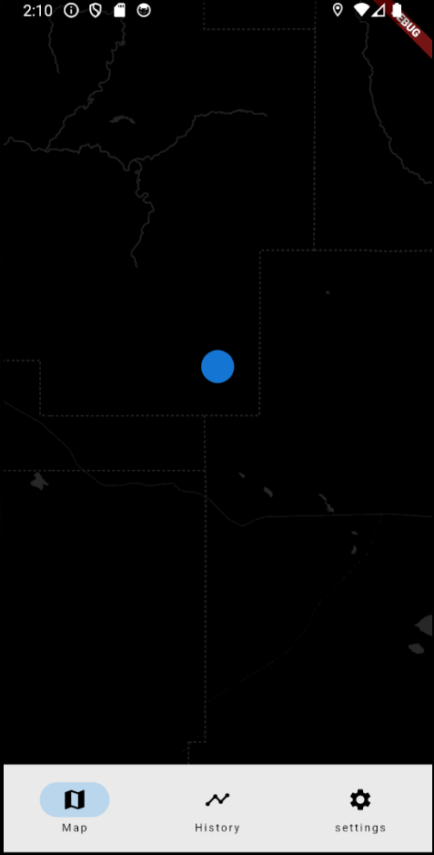
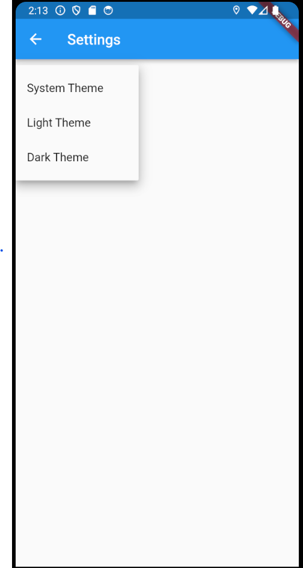

# Been there Done that

The goal of this app is for a user to be able to track of what cities/districs they have been, this is currently very early on as I would still need to create an api that can verify given coordinates and provide geospatial polygons which then can be used in the app to give a visual of the locations that the user has and can track.

## Tech stack

- Flutter
- OpenStreetMap

Current the application has VERY basic functionality and more of template for map based application.

On hold till I develop the API for geospatial checking

## Potential feature/ Ideas

- Time stamps for visited locations
- Location streaks for unique locations
- Leaderboard system (Would need to build a backend for this)
- Share progress with friends